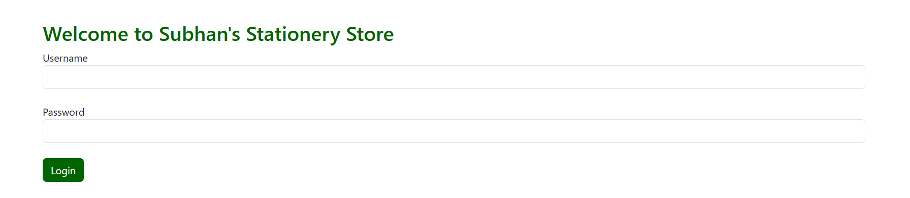

# Stationery Store Management System

## Overview
This is an ASP.NET web application built with VB.NET for managing a stationery store. It provides role-based access for Admins, Managers, and Salespersons to handle users, employees, products, orders, and inventory reports. The application uses SQL Server for data storage and Bootstrap 5 for a clean, responsive UI with a darker green theme (`#003300`).

## Features
- **Authentication**: User login with session-based role checks (Admin: `RoleID=1`, Manager: `RoleID=2`, Salesperson: `RoleID=3`).
- **Dashboard**: Role-specific navigation to management pages.
- **User Management**: Add and view users (`AddUser.aspx`, `Users.aspx`).
- **Employee Management**: Add and manage employees (`AddEmployee.aspx`, `Employees.aspx`).
- **Role Management**: View roles (`Roles.aspx`).
- **Audit**: View login history (`LoginAudit.aspx`).
- **Product Management**: Add, edit, and delete products with category and supplier details (`ManageProducts.aspx`).
- **Order Management**: Add, edit, and delete orders with customer details (`Orders.aspx`).
- **Inventory Reports**: View inventory summary (`InventorySummary.aspx`) and low stock report (placeholder, `LowStockReport.aspx`).
- **UI**: Centered layout with Bootstrap 5, darker green buttons and headers.

## Requirements
- **Platform**: ASP.NET Framework 4.8
- **Database**: SQL Server (hosted on Somee.com)
- **Dependencies**:
  - Bootstrap 5 (CDN: `https://cdn.jsdelivr.net/npm/bootstrap@5.3.3`)
  - SQL Server database with tables: `User_T`, `Employee`, `Role`, `Login_Audit`, `Product`, `Category`, `Supplier`, `Order_T`, `Customer`, `Order_Item`

## Setup Instructions
1. **Clone the Repository**:
   ```bash
   git clone <repository-url>
   ```
2. **Configure Database**:
   - Set up a SQL Server database on Somee.com.
   - Create tables using the provided schema (e.g., `Product`, `Order_T`, etc.).
   - Update `web.config` with your connection string:
     ```xml
     <connectionStrings>
         <add name="myconnstr" connectionString="Server=your_server.somee.com;Database=your_db;User Id=your_user;Password=your_password;" providerName="System.Data.SqlClient" />
     </connectionStrings>
     ```
3. **Deploy to Somee.com**:
   - Upload the project files to `/Demo/Lab11` via Somee.com’s file manager or FTP.
   - Ensure ASP.NET 4.8 is enabled in the hosting settings.
4. **Test the Application**:
   - Access `Login.aspx` to log in with a valid user (e.g., Manager: `RoleID=2`).
   - Navigate through the dashboard to test features.

## Database Notes
- **Product Table**: Ensure the schema matches:
  ```sql
  CREATE TABLE Product (
      Product_ID INT IDENTITY(1,1) PRIMARY KEY,
      Product_Name NVARCHAR(100),
      Price DECIMAL(10,2),
      Stock_Quantity INT,
      Category_ID INT,
      Supplier_ID INT,
      FOREIGN KEY (Category_ID) REFERENCES Category(Category_ID),
      FOREIGN KEY (Supplier_ID) REFERENCES Supplier(Supplier_ID)
  );
  ```
- **LowStockReport.aspx**: Currently a placeholder due to missing `ReorderLevel` column. Add it or use a fixed threshold (e.g., `Stock_Quantity <= 10`) when implementing.

## Future Enhancements
- Implement `LowStockReport.aspx` with `ReorderLevel` or threshold-based logic.
- Add pagination to GridViews (e.g., `ManageProducts.aspx`, `Orders.aspx`).
- Complete remaining pages: `Users.aspx`, `InventoryTransactions.aspx`, `Suppliers.aspx`, `PlaceOrder.aspx`, `AddProduct.aspx`, `Customers.aspx`, `Search.aspx`.

## Contact
For issues or questions, contact the developer or check Somee.com support for deployment assistance.
